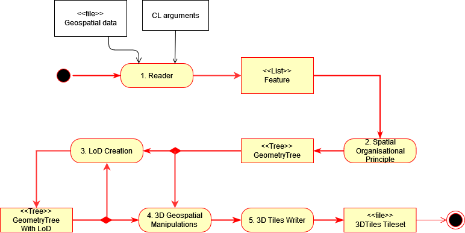
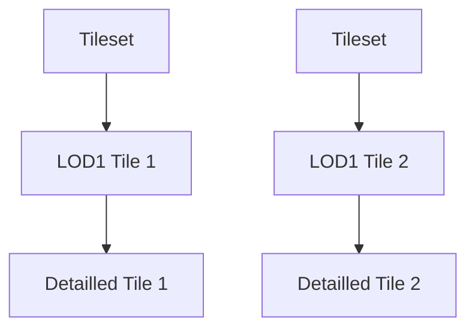
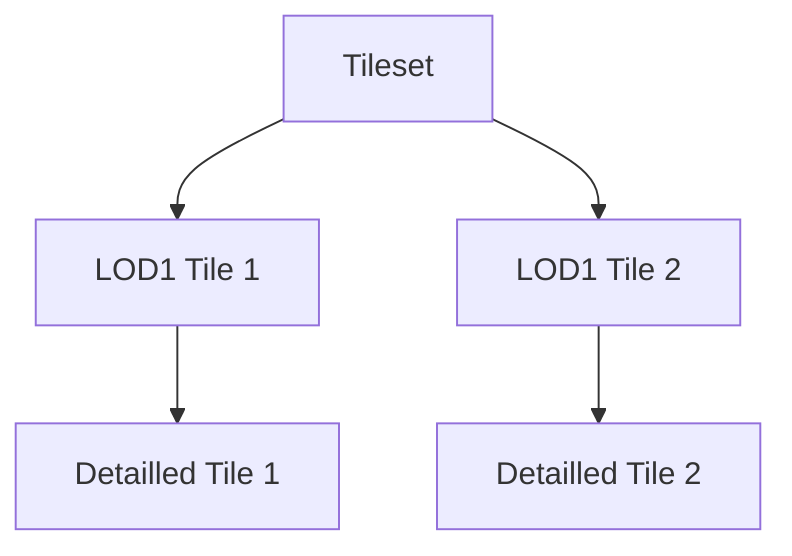

# Tilers features in py3dtilers

This document recaps the main features of the Tilers. For more detail about the usage/particularities of each tiler, see the [usage documentation](https://github.com/VCityTeam/py3dtilers#usage).

## Creation of 3DTiles

The Tilers allow to create 3DTiles tilesets from geospatial and urban data. They share common methods and a common structure.



## Merge tilesets

To merge tilesets together, refer to the [TilesetReader notes](../../py3dtilers/TilesetReader/README.md).

The [TilesetReader](../../py3dtilers/TilesetReader/README.md#run-the-tilesetreader) also allows to transform the merged tilesets, but can have a heavy cost in time/memory.

```bash
tileset-reader --paths <path1> <path2>
```

The [TilesetMerger](../../py3dtilers/TilesetReader/README.md#run-the-tilesetmerger) can only merge the tilesets, but is faster and lighter than the `TilesetReader`.

```bash
tileset-merger --paths <path1> <path2>
```

Example of input tilesets:



Result after merge:



## Temporal 3DTiles

To create temporal 3DTiles, refer to the [CityTemporalTiler notes](../../py3dtilers/CityTiler/README.md#citytemporaltiler-features).


## Levels of detail

Description: Creates levels of detail in the tileset.

Flag(s): `--lod1` and `--loa <path>`

Example: `citygml-tiler --db_config_path config.yml --lod1 --loa polygons.geojson`

| Tiler | |
| --- | --- |
| CityTiler | :heavy_check_mark: |
| ObjTiler | :heavy_check_mark: |
| GeojsonTiler | :heavy_check_mark: |
| IfcTiler | :heavy_check_mark: |
| TilesetTiler | :x: |


## Texture

Description: Creates textured 3DTiles.

Flag(s): `--with_texture`

Example: `citygml-tiler --db_config_path config.yml --with_texture`

| Tiler | |
| --- | --- |
| CityTiler | :heavy_check_mark: |
| ObjTiler | :heavy_check_mark: |
| GeojsonTiler | :x: |
| IfcTiler | :x: |
| TilesetTiler | :heavy_check_mark: |


## Color

Description: Creates colored 3DTiles.

Flag(s): `--add_color <attribute> <type>`

Example: `geojson-tiler --path buildings.geojson --add_color HEIGHT numeric`

| Tiler | |
| --- | --- |
| CityTiler | :heavy_check_mark: |
| ObjTiler | :x: |
| GeojsonTiler | :heavy_check_mark: |
| IfcTiler | :x: |
| TilesetTiler | :x: |


## Reprojection

Description: Projects the tileset in a different CRS.

Flag(s): `--crs_in <epsg>` and `--crs_out <epsg>`

Example: `citygml-tiler --db_config_path config.yml --crs_in EPSG:3946 --crs_out EPSG:4978`

| Tiler | |
| --- | --- |
| CityTiler | :heavy_check_mark: |
| ObjTiler | :heavy_check_mark: |
| GeojsonTiler | :heavy_check_mark: |
| IfcTiler | :heavy_check_mark: |
| TilesetTiler | :heavy_check_mark: |


## Scaling

Description: Rescale the 3DTiles.

Flag(s): `--scale <factor>`

Example: `obj-tiler --paths obj_models --scale 20`

| Tiler | |
| --- | --- |
| CityTiler | :heavy_check_mark: |
| ObjTiler | :heavy_check_mark: |
| GeojsonTiler | :heavy_check_mark: |
| IfcTiler | :heavy_check_mark: |
| TilesetTiler | :heavy_check_mark: |


## Translation

Description: Translates the tileset on \[x, y, z\] axis.

Flag(s): `--offset <x> <y> <z>`

Example: `geojson-tiler --path buildings.geojson --offset 0 0 100`

| Tiler | |
| --- | --- |
| CityTiler | :heavy_check_mark: |
| ObjTiler | :heavy_check_mark: |
| GeojsonTiler | :heavy_check_mark: |
| IfcTiler | :heavy_check_mark: |
| TilesetTiler | :heavy_check_mark: |


## Export as OBJs

Description: Exports the leaves of the tileset as OBJ.

Flag(s): `--obj <file_name>`

Example: `citygml-tiler --db_config_path config.yml --obj buildings.obj`

| Tiler | |
| --- | --- |
| CityTiler | :heavy_check_mark: |
| ObjTiler | :heavy_check_mark: |
| GeojsonTiler | :heavy_check_mark: |
| IfcTiler | :heavy_check_mark: |
| TilesetTiler | :heavy_check_mark: |


