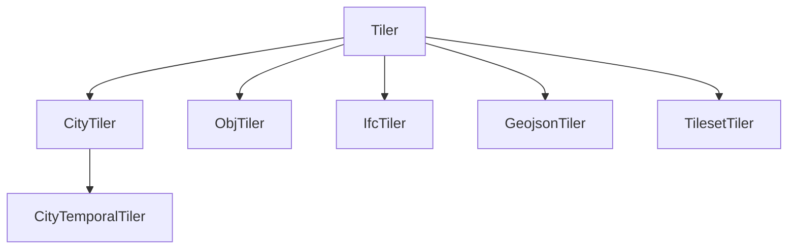
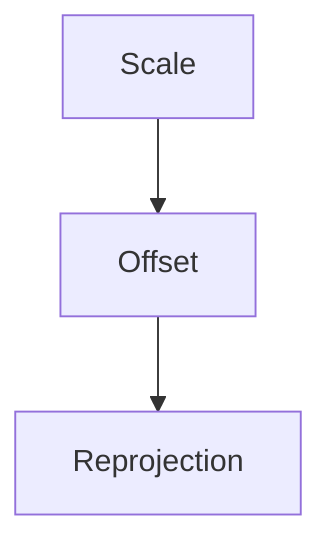
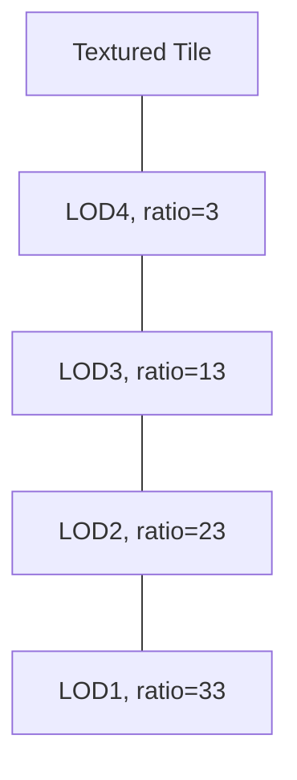
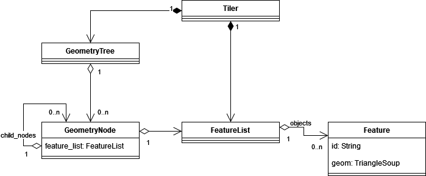
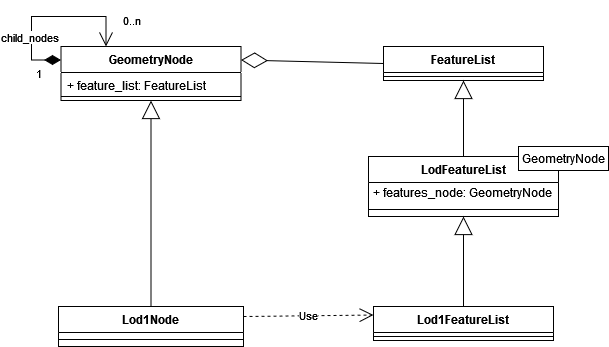
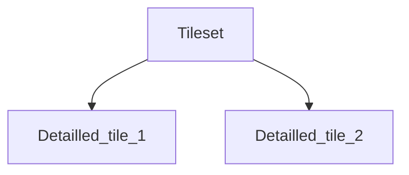
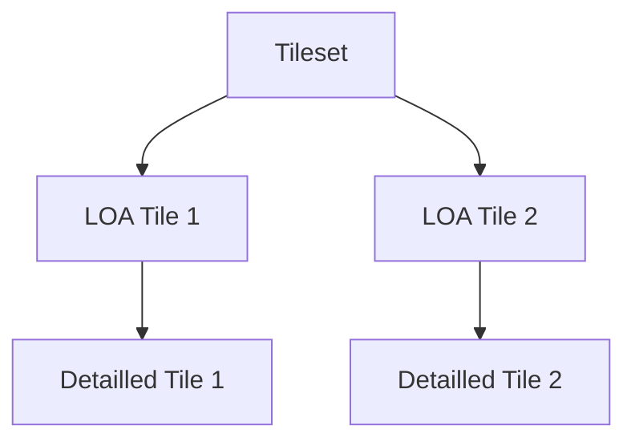
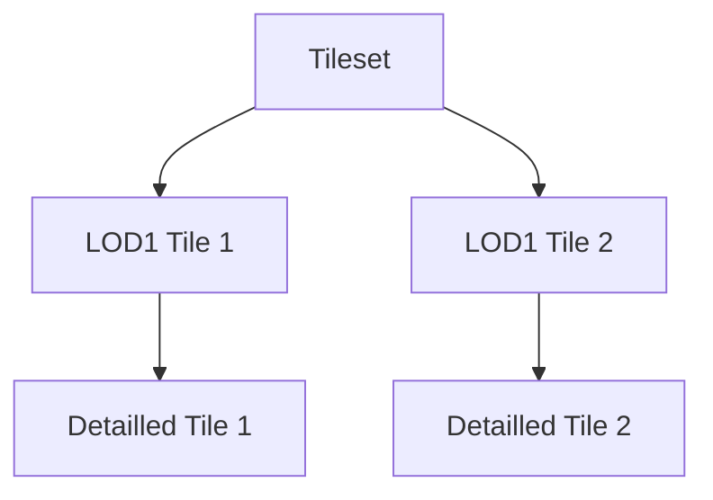
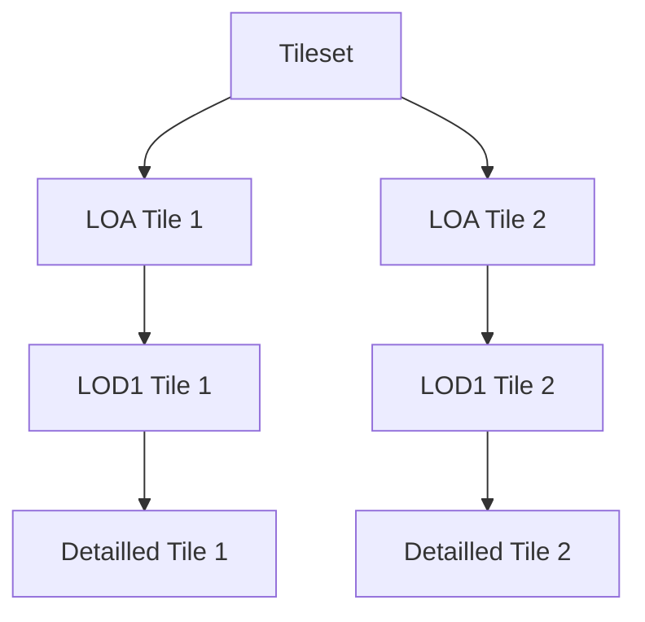

# Common Module

## Common Tiler features

Those features are shared by all the Tilers inheriting from [`Tiler`](tiler.py) class.



Some features may not have been implemented for some Tilers.

### Input

| Tiler        |                    |
| ------------ | ------------------ |
| CityTiler    | :heavy_check_mark: |
| ObjTiler     | :heavy_check_mark: |
| GeojsonTiler | :heavy_check_mark: |
| IfcTiler     | :heavy_check_mark: |
| TilesetTiler | :heavy_check_mark: |

The flag `-i` allows to choose the input paths of the Tiler.

The flag should be followed by paths to files or directories holding a set of files.

```bash
<tiler> -i <path>
```

Note that `--paths`, `--path`, `--file_path` and `--db_config_file` were kept as alternatives of `-i` to ensure retro-compability.

### Output

| Tiler        |                    |
| ------------ | ------------------ |
| CityTiler    | :heavy_check_mark: |
| ObjTiler     | :heavy_check_mark: |
| GeojsonTiler | :heavy_check_mark: |
| IfcTiler     | :heavy_check_mark: |
| TilesetTiler | :heavy_check_mark: |

The flags `--output_dir`, `--out` or `-o` allow to choose the output directory of the Tiler.

```bash
<tiler> <input> --output_dir <output_directory_path>
```

### LOA

| Tiler        |                    |
| ------------ | ------------------ |
| CityTiler    | :heavy_check_mark: |
| ObjTiler     | :heavy_check_mark: |
| GeojsonTiler | :heavy_check_mark: |
| IfcTiler     | :heavy_check_mark: |
| TilesetTiler | :x:                |

Using the LOA\* option creates a tileset with a **refinement hierarchy**. The leaves of the created tree are the detailed features (features loaded from the data source) and their parents are LOA features of those detailed features. The LOA features are 3D extrusions of polygons. The polygons must be given as a path to a Geojson file, or a directory containing Geojson file(s) (the features in those geojsons must be Polygons or MultiPolygons). The polygons can for example be roads, boroughs, rivers or any other geographical partition.

To use the LOA option:

```bash
<tiler> <input> --loa <path-to-polygons>
```

\*_LOA (Level Of Abstraction): here, it is simple 3D extrusion of a polygon._

### LOD1

| Tiler        |                    |
| ------------ | ------------------ |
| CityTiler    | :heavy_check_mark: |
| ObjTiler     | :heavy_check_mark: |
| GeojsonTiler | :heavy_check_mark: |
| IfcTiler     | :heavy_check_mark: |
| TilesetTiler | :x:                |

_**Warning**: creating LOD1 can be useless if the features are already footprints._

Using the LOD1 option creates a tileset with a **refinement hierarchy**. The leaves of the created tree are the detailed features (features loaded from the data source) and their parents are LOD1 features of those detailed features. The LOD1 features are 3D extrusions of the footprints of the features.

To use the LOD1 option:

```bash
<tiler> <input> --lod1
```

### Obj creation

| Tiler        |                    |
| ------------ | ------------------ |
| CityTiler    | :heavy_check_mark: |
| ObjTiler     | :heavy_check_mark: |
| GeojsonTiler | :heavy_check_mark: |
| IfcTiler     | :heavy_check_mark: |
| TilesetTiler | :heavy_check_mark: |

An .obj model (without texture) is created if the `--obj` flag is present in command line. To create an obj file, use:

```bash
<tiler> <input> --obj <obj_file_name>
```

### 3D transformations

During the tiling process, 3D transformations are done in the following order:



#### Scale

| Tiler        |                    |
| ------------ | ------------------ |
| CityTiler    | :heavy_check_mark: |
| ObjTiler     | :heavy_check_mark: |
| GeojsonTiler | :heavy_check_mark: |
| IfcTiler     | :heavy_check_mark: |
| TilesetTiler | :heavy_check_mark: |

Rescale the features by a factor:

```bash
<tiler> <input> --scale 10
```

#### Offset

| Tiler        |                    |
| ------------ | ------------------ |
| CityTiler    | :heavy_check_mark: |
| ObjTiler     | :heavy_check_mark: |
| GeojsonTiler | :heavy_check_mark: |
| IfcTiler     | :heavy_check_mark: |
| TilesetTiler | :heavy_check_mark: |

Translate the features by **adding** an offset. :

```bash
<tiler> <input> --offset 10 20 30  # 10 on X, 20 on Y, 30 on Z
```

It is also possible to translate a tileset by its own centroid by using `centroid` as parameter:

```bash
<tiler> <input> --offset centroid
```

_**Warning**: The offset applied should be using the same projection system as the features_

#### Reprojection

| Tiler        |                    |
| ------------ | ------------------ |
| CityTiler    | :heavy_check_mark: |
| ObjTiler     | :heavy_check_mark: |
| GeojsonTiler | :heavy_check_mark: |
| IfcTiler     | :heavy_check_mark: |
| TilesetTiler | :heavy_check_mark: |

Project the features on another CRS. The `crs_in` flag allows to specify the input CRS (default is EPSG:3946). The `crs_out` flag projects the features in another CRS (default output CRS is EPSG:3946).

```bash
<tiler> <input> --crs_in EPSG:3946 --crs_out EPSG:4171
```

### No Normals

| Tiler        |                    |
| ------------ | ------------------ |
| CityTiler    | :heavy_check_mark: |
| ObjTiler     | :heavy_check_mark: |
| GeojsonTiler | :heavy_check_mark: |
| IfcTiler     | :heavy_check_mark: |
| TilesetTiler | :heavy_check_mark: |

Optionally disable creation of normals in 3D tiles:

```bash
<tiler> <input> --no_normals
```

This could be very useful for 3D tiles created out Photogrammetry OBJ meshes. If normals are not present, Cesium wil display tiles using flat lighning.

### Height units multiplier

| Tiler        |                    |
| ------------ | ------------------ |
| CityTiler    | :heavy_check_mark: |
| ObjTiler     | :heavy_check_mark: |
| GeojsonTiler | :heavy_check_mark: |
| IfcTiler     | :heavy_check_mark: |
| TilesetTiler | :heavy_check_mark: |

Optionally specify units multipler for dataset height values.

```bash
<tiler> <input> --height_mult 0.3048006096
```

This is useful if your crs_in is not using meters as units. For example, State Plane coordinate systems in US might use US survey feet as units. Tiling code expects height values to be in meters and all height values in a mesh need to be multiplied by 0.3048006096 to convert meters to US Survey feet.

### With texture

| Tiler        |                    |
| ------------ | ------------------ |
| CityTiler    | :heavy_check_mark: |
| ObjTiler     | :heavy_check_mark: |
| GeojsonTiler | :x:                |
| IfcTiler     | :x:                |
| TilesetTiler | :heavy_check_mark: |

Read the texture from the input and write it in image atlases (JPEG or PNG files):

```bash
<tiler> <input> --with_texture
```

You can choose the file format of the image with the flag `--format`. The two formats available are **JPEG** and **PNG**. By default, the images will be saved in the JPEG format.

Two flags can be use to reduce the size of the images. The flag `--quality` can be used to change the quality of the **JPEG images**. Quality varies between 1 and 100, where 100 is the maximum quality. The flag `--compress_level` can be used to compress the **PNG images**. Compression level varies between 0 and 9, where 9 is the maximum level and compression and where 0 doesn't compress the texture. By default, the quality of the JPEGs is set to 75 and the compress level of the PNGs is set to 0.

```bash
<tiler> <input> --with_texture --format jpeg --quality 10
```

```bash
<tiler> <input> --with_texture --format png --compress_level 6
```

_Note: if your texture images are too heavy, consider using [`--kd_tree_max` option](#kd-tree-max) to reduce the number of objects per tile._

### Texture LODs

| Tiler        |                    |
| ------------ | ------------------ |
| CityTiler    | :heavy_check_mark: |
| ObjTiler     | :heavy_check_mark: |
| GeojsonTiler | :x:                |
| IfcTiler     | :x:                |
| TilesetTiler | :x:                |

The flag `--texture_lods` (or `--tl`) can be used to set the number of levels of detail that will be created for each textured tile. Each level of detail will be a tile with a less detailled image but the same geometry. The size of the images is reduced with a [Nearest Neighbor Resampling algorithm](https://clouard.users.greyc.fr/Pantheon/experiments/rescaling/index-en.html#nearest).

```bash
<tiler> <input> --texture_lods 4  # Create 4 additional tiles for each textured tile
```

The first additional level has downsize ratio of 3, meaning the image will be 3 times smaller than the original. Then each following level increment this ratio by 10.



### Geometric error

| Tiler        |                    |
| ------------ | ------------------ |
| CityTiler    | :heavy_check_mark: |
| ObjTiler     | :heavy_check_mark: |
| GeojsonTiler | :heavy_check_mark: |
| IfcTiler     | :heavy_check_mark: |
| TilesetTiler | :heavy_check_mark: |

In 3DTiles, [the geometric error](https://github.com/CesiumGS/3d-tiles/tree/main/specification#geometric-error) (**GE**) is the metric used to refine a tile or not. A tile should always have a lower geometric error than its parent. The root of the tileset should have the highest geometric error and the leaves the lowest geometric error.

The geometric errors of the tiles can be overwritten with the flag `--geometric_error`. The values after the flag will be used (from left to right) for the deeper tiles (leaves), their parents (if existing), etc until the root tiles of the tileset.

```bash
<tiler> <input> --geometric_error 5 60 100  # Set leaf tiles GE to 5, their parents GE to 60 and root tiles GE to 100
```

You can set the geometric error of the leaf tiles only with:

```bash
<tiler> <input> --geometric_error 5  # Set leaf tiles GE to 5
```

You can skip leaf tiles and their parents geometric errors by writing a non numeric character as geometric error.

```bash
<tiler> <input> --geometric_error x x 100  # Set root tiles GE to 100
```

### Kd-tree max

| Tiler        |                    |
| ------------ | ------------------ |
| CityTiler    | :heavy_check_mark: |
| ObjTiler     | :heavy_check_mark: |
| GeojsonTiler | :heavy_check_mark: |
| IfcTiler     | :heavy_check_mark: |
| TilesetTiler | :heavy_check_mark: |

`--kd_tree_max` allows to choose the maximum number of features in each tile when the features are distributed by a kd-tree. The flag must be followed by an **integer**. By default, each tile contains a maximum of 500 features.

When using the CityTiler [with texture](#with-texture), the default maximum of features per tile is divided by **20** in order to reduce the size of texture atlases. If a tile contains too much textured features, its atlas may be to heavy in memory, so consider choosing a `kd_tree_max` according to the resolution/size of the texture images.

```bash
<tiler> <input> --kd_tree_max 25  # Each tile will contain a maximum of 25 features
```

### ID filter

| Tiler        |                    |
| ------------ | ------------------ |
| CityTiler    | :heavy_check_mark: |
| ObjTiler     | :heavy_check_mark: |
| GeojsonTiler | :heavy_check_mark: |
| IfcTiler     | :x: |
| TilesetTiler | :heavy_check_mark: |

The flag `--keep_ids` and `--exclude_ids` allows to filter the features. The flag must be followed by a list of IDs.

`--keep_ids` keeps **only** the features which have their ID in the list.

```bash
<tiler> <input> --keep_ids id_1 id_2  # Keep only the features with those IDs
```

`--exclude_ids` **exclude** the features which have their ID in the list.

```bash
<tiler> <input> --exclude_ids id_1 id_2  # Exclude the features with those IDs
```

## Developper notes

## [feature](feature.py)

### Feature

A `Feature` instance contains a geometry, a bounding box, and optionally can contain semantic data.  
The geometry is a [TriangleSoup](https://github.com/VCityTeam/py3dtiles/blob/master/py3dtiles/wkb_utils.py), those triangles will be used to create the 3Dtiles geometry.
To set the triangles of a `Feature` instance, use:

```python
triangles = [[np.array([0., 0., 0.]), # First triangle
              np.array([1., 0., 0.]),
              np.array([1., 1., 0.])],
             [np.array([0., 0., 1.]), # Second triangle
              np.array([1., 0., 1.]),
              np.array([1., 1., 1.])]] # Each np.array is a vertex with [x, y, z] coordinates
feature = Feature("id")
feature.geom.triangles.append()
```

The bounding box is a box containing the `Feature` instance's geometry. It can be set with:

```python
feature.set_box()
```

The semantic data contained in the object represents application specific data. This data can be added to the [Batch Table](https://github.com/CesiumGS/3d-tiles/blob/main/specification/TileFormats/BatchTable/README.md) in 3Dtiles.

This data must be structured as a [Dictionary](https://www.w3schools.com/python/python_dictionaries.asp) of key/value pairs and can be set with:

```python
feature.set_batchtable_data()
```

### FeatureList

A `FeatureList` instance contains a list of `Feature` instances. To create a `FeatureList`, use:

```python
objects = [feature] # List of Feature(s)

feature_list = FeatureList(objects)
for object in feature_list:
    print(object.get_id())
```



## [obj_writer](obj_writer.py)

This class allows to write `FeatureList` as an OBJ model. To write features in a file, use:

```python
obj_writer = ObjWriter()
obj_writer.add_geometries(feature_list)   # feature_list contains Feature instances
obj_writer.write_obj(file_name)
```

## [polygon_extrusion](polygon_extrusion.py)

`ExtrudedPolygon` inherits from `Feature` class. Its constructor takes:

- an ID
- a list of features
- (optionally) a polygon as list of points

Using the `set_geom` method of an instance of `ExtrudedPolygon` will create a 3D model by computing the footprint of the features then extruding this footprint. If the `ExtrudedPolygon` has a polygon, this polygon will be used instead of the footprint.

To create an extrusion, use:

```python
extruded_polygon = ExtrudedPolygon("ep_1", [feature])
extruded_polygon.set_geom()  # it will extrude the footprint of the feature
```

```python
extruded_polygon = ExtrudedPolygon("ep_2", [feature_1, feature_2], polygon=polygon)
extruded_polygon.set_geom()  # it will extrude the polygon, but it will use the geometries of the feature to compute the altitude and the height of the 3D model
```

## [group](group.py)

An instance of _Group_ contains features (`FeatureList`). It can also contains additional data which is polygons (a polygon as list of points, and a point is a list of float).

The static methods in the _Group_ class allow to distribute `FeatureList` into groups following specific rules.  
The groups can be created with:

```python
# Group together the objects which are in the same polygon
# Takes : an FeatureList, a path to a Geojson file containing polygons, or a folder containing Geojson files
groups = Group.group_objects_by_polygons(feature_list, polygons_path)
```

```python
# Group together the objects with close centroids
# Takes : an FeatureList
groups = Group.group_objects_with_kdtree(feature_list)
```

## [kd_tree](kd_tree.py)

The kd_tree distributes the `Feature` instances contained in a `FeatureList` into multiple `FeatureList`. Each instance of `FeatureList` can have a maximum of `maxNumObjects`:

```python
# Takes : an FeatureList
# Returns : a list of FeatureList
distributed_objects = kd_tree(feature_list, 100) # Max 100 objects per FeatureList
```

## [geometry_node](geometry_node.py)

### GeometryNode

A _GeometryNode_ contains features as `FeatureList` and a list of child nodes. It also contains a [geometric error](http://docs.opengeospatial.org/cs/18-053r2/18-053r2.html#27) which is the distance to display the 3D tile created from this node.

To create a _GeometryNode_:

```python
# Takes : features as FeatureList, a geometric error (int)
# Returns : a node containing the features
node = GeometryNode(feature_list, geometric_error=20)
```

To add a child to a node:

```python
node.add_child_node(other_node)
```

### [Lod1Node](lod1_node.py)

_Lod1Node_ inherits from _GeometryNode_. When instanced, a _Lod1Node_ creates a 3D extrusion of the footprint of each `Feature` instance in the `FeatureList` parameter.

To create a _Lod1Node_:

```python
# Takes : features as FeatureList, a geometric error (int)
# Returns : a node containing 3D extrusions of the features
node = Lod1Node(feature_list, geometric_error=20)
```



### [LoaNode](loa_node.py)

_LoaNode_ inherits from _GeometryNode_. When instanced, a _LoaNode_ creates a 3D extrusion of the polygons (list of points, where a point is a list of float) given as parameter.

To create a _LoaNode_:

```python
# Takes : features as FeatureList,
          a geometric error (int),
          a list of polygons,
          a dictionary {polygon_index -> [object_index(es)]}
# Returns : a node containing 3D extrusions of the polygons
node = LoaNode(feature_list, geometric_error=20, polygons=polygons)
```


## [lod_tree](lod_tree.py)

lod_tree creates a tileset with a parent-child hierarchy. Each node of the tree contains a `FeatureList` (the features of the node) and a list of child nodes.
A node will correspond to a tile (.b3dm file) of the tileset.  
The leaves of the tree contain the features with the most details. The parent node of each node contains a lower level of details.

The lod_tree creation takes a `FeatureList` (containing `Feature` instances with detailled features and bounding boxes) and returns a tileset.

The first step of the tree creation is the distribution of `Feature` instances into groups. A group is an instance of [_Group_](#group) where the features (`FeatureList`) are a group of detailed features. The group can also contains additional data which is polygons and a dictionary to stock the indexes of the features contained in each polygon, this additional data is used to create [_LoaNode(s)_](#loanode).  
The groups are either created with polygons or with the kd_tree (see [group](#group)).

To create a tileset with LOA\*, use:

```python
LodTree(feature_list, # Objects to transform into 3Dtiles
               create_loa=True, # Indicate to create a LOA
               polygons_path="./path/to/dir") # Path to a Geojson file containing polygons, or a folder with many Geojson files
```

\* _Level Of Abstraction_, it consists in a tile with a low level of details and an abstract geometry representing multiple features (for example a cube to represent a block of buildings).

Resulting tilesets:

If no level of details is added:



If the LOA is created:



LOD1 (Level Of Details 1) tiles can also be added in the tileset. A LOD1 is a simplified version of a `Feature` instance's geometry.
It consists in a 3D extrusion of the footprint of the geometry.

To create a tileset with LOD1, use:

```python
LodTree(feature_list, # Objects to transform into 3Dtiles
               create_lod1=True) # Indicate to create a LOD1
```

Resulting tilesets:



A tileset can be created with both LOD1 and LOA with:

```python
LodTree(feature_list, # Objects to transform into 3Dtiles
               create_lod1=True, # Indicate to create a LOD1
               create_loa=True, # Indicate to create a LOA
               polygons_path="./path/to/dir") # Path to a Geojson file containing polygons, or a folder with many Geojson files
```

Resulting tilesets:


