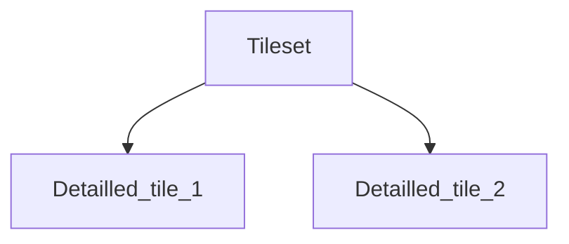
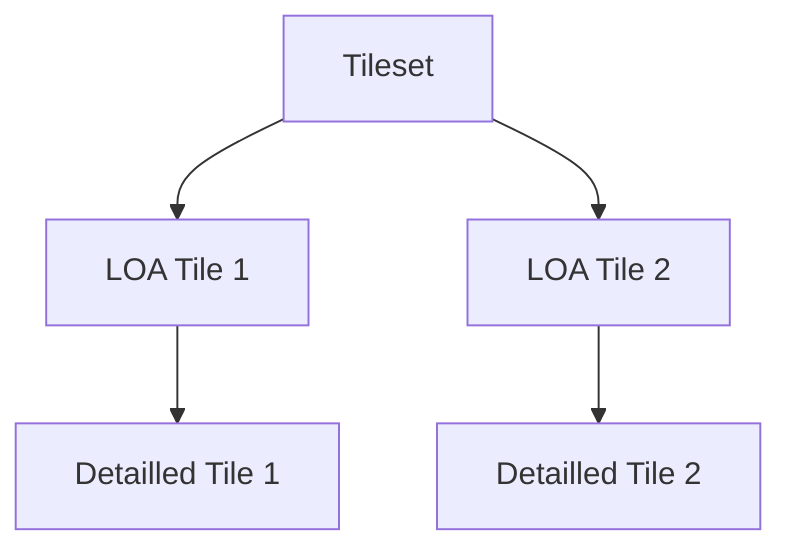
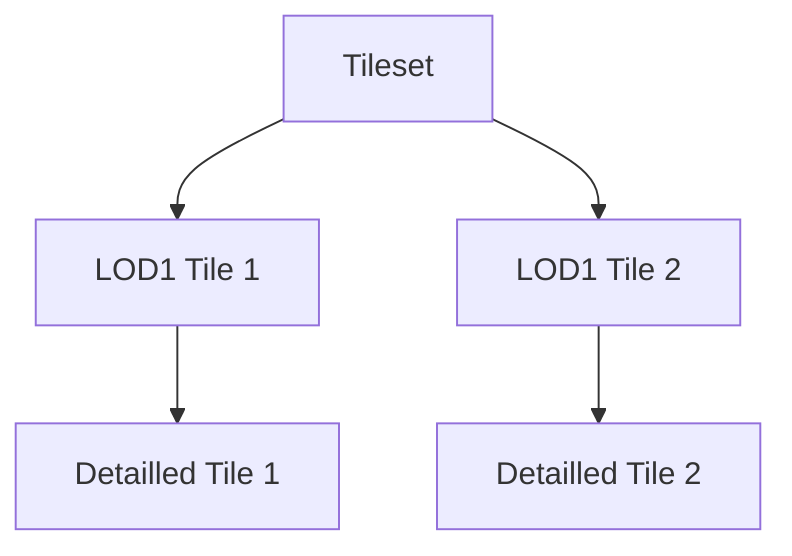
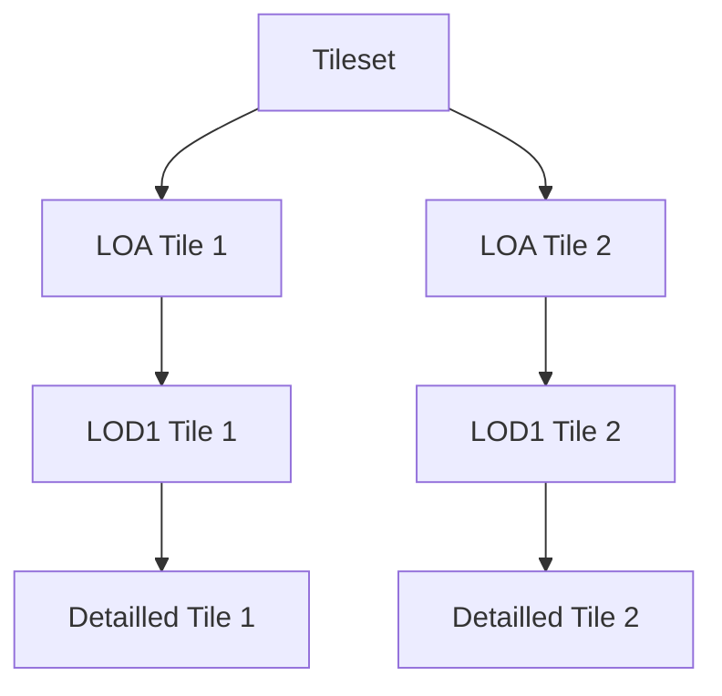

# Common Module

## Common Tiler features

Those features are shared by all the Tilers inheriting from [`Tiler`](tiler.py) class.

Some features may not have been implemented for some Tilers.

### Output directory

| Tiler | |
| --- | --- |
| CityTiler | :heavy_check_mark: |
| ObjTiler | :heavy_check_mark: |
| GeojsonTiler | :heavy_check_mark: |
| IfcTiler | :heavy_check_mark: |
| TilesetTiler | :heavy_check_mark: |

The flags `--output_dir`, `--out` or `-o` allow to choose the output directory of the Tiler.

```bash
<tiler> <input> --output_dir <output_directory_path>
```

### LOA

| Tiler | |
| --- | --- |
| CityTiler | :heavy_check_mark: |
| ObjTiler | :heavy_check_mark: |
| GeojsonTiler | :heavy_check_mark: |
| IfcTiler | :heavy_check_mark: |
| TilesetTiler | :x: |

Using the LOA\* option creates a tileset with a __refinement hierarchy__. The leaves of the created tree are the detailed features (features loaded from the data source) and their parents are LOA features of those detailed features. The LOA features are 3D extrusions of polygons. The polygons must be given as a path to a Geojson file, or a directory containing Geojson file(s) (the features in those geojsons must be Polygons or MultiPolygons). The polygons can for example be roads, boroughs, rivers or any other geographical partition.

To use the LOA option:

```bash
<tiler> <input> --loa <path-to-polygons>
```

\*_LOA (Level Of Abstraction): here, it is simple 3D extrusion of a polygon._

### LOD1

| Tiler | |
| --- | --- |
| CityTiler | :heavy_check_mark: |
| ObjTiler | :heavy_check_mark: |
| GeojsonTiler | :heavy_check_mark: |
| IfcTiler | :heavy_check_mark: |
| TilesetTiler | :x: |

___Warning__: creating LOD1 can be useless if the features are already footprints._

Using the LOD1 option creates a tileset with a __refinement hierarchy__. The leaves of the created tree are the detailed features (features loaded from the data source) and their parents are LOD1 features of those detailed features. The LOD1 features are 3D extrusions of the footprints of the features.

To use the LOD1 option:

```bash
<tiler> <input> --lod1
```

### Obj creation

| Tiler | |
| --- | --- |
| CityTiler | :heavy_check_mark: |
| ObjTiler | :heavy_check_mark: |
| GeojsonTiler | :heavy_check_mark: |
| IfcTiler | :heavy_check_mark: |
| TilesetTiler | :heavy_check_mark: |

An .obj model (without texture) is created if the `--obj` flag is present in command line. To create an obj file, use:

```bash
<tiler> <input> --obj <obj_file_name>
```

### Scale

| Tiler | |
| --- | --- |
| CityTiler | :heavy_check_mark: |
| ObjTiler | :heavy_check_mark: |
| GeojsonTiler | :heavy_check_mark: |
| IfcTiler | :heavy_check_mark: |
| TilesetTiler | :heavy_check_mark: |

Rescale the features by a factor:

```bash
<tiler> <input> --scale 10
```

### Offset

| Tiler | |
| --- | --- |
| CityTiler | :heavy_check_mark: |
| ObjTiler | :heavy_check_mark: |
| GeojsonTiler | :heavy_check_mark: |
| IfcTiler | :heavy_check_mark: |
| TilesetTiler | :heavy_check_mark: |

Translate the features by __substracting__ an offset. :

```bash
<tiler> <input> --offset 10 20 30  # -10 on X, -20 on Y, -30 on Z
```

It is also possible to translate a tileset by its own centroid by using `centroid` as parameter:

```bash
<tiler> <input> --offset centroid
```

### CRS in/out

| Tiler | |
| --- | --- |
| CityTiler | :heavy_check_mark: |
| ObjTiler | :heavy_check_mark: |
| GeojsonTiler | :heavy_check_mark: |
| IfcTiler | :heavy_check_mark: |
| TilesetTiler | :heavy_check_mark: |

Project the features on another CRS. The `crs_in` flag allows to specify the input CRS (default is EPSG:3946). The `crs_out` flag projects the features in another CRS (default output CRS is EPSG:3946).

```bash
<tiler> <input> --crs_in EPSG:3946 --crs_out EPSG:4171
```

### With texture

| Tiler | |
| --- | --- |
| CityTiler | :heavy_check_mark: |
| ObjTiler | :heavy_check_mark: |
| GeojsonTiler | :x: |
| IfcTiler | :x: |
| TilesetTiler | :heavy_check_mark: |

Read the texture from the input and write it in the produced 3DTiles:

```bash
<tiler> <input> --with_texture
```

### Geometric error

| Tiler | |
| --- | --- |
| CityTiler | :heavy_check_mark: |
| ObjTiler | :heavy_check_mark: |
| GeojsonTiler | :heavy_check_mark: |
| IfcTiler | :heavy_check_mark: |
| TilesetTiler | :heavy_check_mark: |

In 3DTiles, [the geometric error](https://github.com/CesiumGS/3d-tiles/tree/main/specification#geometric-error) (__GE__) is the metric used to refine a tile or not. A tile should always have a lower geometric error than its parent. The root of the tileset should have the highest geometric error and the leaves the lowest geometric error.

The geometric errors of the tiles can be overwritten with the flag `--geometric_error`. The values after the flag will be used (from left to right) for the deeper tiles (leaves), their parents (if existing), etc until the root tiles of the tileset.

```bash
tileset-reader --paths <tileset_path> --geometric_error 5 60 100  # Set leaf tiles GE to 5, their parents GE to 60 and root tiles GE to 100
```

You can set the geometric error of the leaf tiles only with:

```bash
tileset-reader --paths <tileset_path> --geometric_error 5  # Set leaf tiles GE to 5
```

You can skip leaf tiles and their parents geometric errors by writing a non numeric character as geometric error.

```bash
tileset-reader --paths <tileset_path> --geometric_error x x 100  # Set root tiles GE to 100
```

## __Developper notes__

## [feature](feature.py)

### Feature

A `Feature` instance contains a geometry, a bounding box, and optionally can contain semantic data.  
The geometry is a [TriangleSoup](https://github.com/VCityTeam/py3dtiles/blob/master/py3dtiles/wkb_utils.py), those triangles will be used to create the 3Dtiles geometry.
To set the triangles of a `Feature` instance, use:  

```python
triangles = [[np.array([0., 0., 0.], dtype=np.float32), # First triangle
              np.array([1., 0., 0.], dtype=np.float32),
              np.array([1., 1., 0.], dtype=np.float32)],
             [np.array([0., 0., 1.], dtype=np.float32), # Second triangle
              np.array([1., 0., 1.], dtype=np.float32),
              np.array([1., 1., 1.], dtype=np.float32)]] # Each np.array is a vertex with [x, y, z] coordinates
feature = Feature("id")
feature.geom.triangles.append()
```

The bounding box is a box containing the `Feature` instance's geometry. It can be set with:

```python
feature.set_box()
```

The semantic data contained in the object represents application specific data. This data can be added to the [Batch Table](https://github.com/CesiumGS/3d-tiles/blob/main/specification/TileFormats/BatchTable/README.md) in 3Dtiles.

This data must be structured as a [Dictionary](https://www.w3schools.com/python/python_dictionaries.asp) of key/value pairs and can be set with:

```python
feature.set_batchtable_data()
```

### FeatureList

A `FeatureList` instance contains a list of `Feature` instances. To create a `FeatureList`, use:

```python
objects = [feature] # List of Feature(s)

feature_list = FeatureList(objects)
for object in feature_list:
    print(object.get_id())
```

## [obj_writer](obj_writer.py)

This class allows to write `FeatureList` as an OBJ model. To write features in a file, use:

```python
obj_writer = ObjWriter()
obj_writer.add_geometries(feature_list)   # feature_list contains Feature instances
obj_writer.write_obj(file_name)
```

## [polygon_extrusion](polygon_extrusion.py)

An instance of _ExtrudedPolygon_ contains a footprint (a polygon as list of points, and a point is a list of float), a minimal height and a maximal height.

The static method `create_footprint_extrusion` from _ExtrudedPolygon_ allows to create a `Feature` instance which is the extrusion of the footprint of another `Feature` instance. The height of the extrusion will be _max height - min height_ of the _ExtrudedPolygon_

To create an extrusion, use:

```python
extruded_object = ExtrudedPolygon.create_footprint_extrusion(feature)
```

_Note_: the footprint to extrude is computed from the `feature` param, but you can give another polygon to extrude (that will replace the footprint):

```python
extruded_object = ExtrudedPolygon.create_footprint_extrusion(feature, override_points=True, polygon=points)
```

## [group](group.py)

An instance of _Group_ contains features (`FeatureList`). It can also contains additional data which is polygons (a polygon as list of points, and a point is a list of float).

The static methods in the _Group_ class allow to distribute `FeatureList` into groups following specific rules.  
The groups can be created with:

```python
# Group together the objects which are in the same polygon
# Takes : an FeatureList, a path to a Geojson file containing polygons, or a folder containing Geojson files
groups = Group.group_objects_by_polygons(feature_list, polygons_path)
```

```python
# Group together the objects with close centroids
# Takes : an FeatureList
groups = Group.group_objects_with_kdtree(feature_list)
```

## [kd_tree](kd_tree.py)

The kd_tree distributes the `Feature` instances contained in a `FeatureList` into multiple `FeatureList`. Each instance of `FeatureList` can have a maximum of `maxNumObjects`:

```python
# Takes : an FeatureList
# Returns : a list of FeatureList
distributed_objects = kd_tree(feature_list, 100) # Max 100 objects per FeatureList
```

## [geometry_node](geometry_node.py)

### GeometryNode

A _GeometryNode_ contains features as `FeatureList` and a list of child nodes. It also contains a [geometric error](http://docs.opengeospatial.org/cs/18-053r2/18-053r2.html#27) which is the distance to display the 3D tile created from this node.

To create a _GeometryNode_:

```python
# Takes : features as FeatureList, a geometric error (int)
# Returns : a node containing the features
node = GeometryNode(feature_list, geometric_error=20)
```

To add a child to a node:

```python
node.add_child_node(other_node)
```

### [Lod1Node](lod1_node.py)

_Lod1Node_ inherits from _GeometryNode_. When instanced, a _Lod1Node_ creates a 3D extrusion of the footprint of each `Feature` instance in the `FeatureList` parameter.

To create a _Lod1Node_:

```python
# Takes : features as FeatureList, a geometric error (int)
# Returns : a node containing 3D extrusions of the features
node = Lod1Node(feature_list, geometric_error=20)
```

### [LoaNode](loa_node.py)

_LoaNode_ inherits from _GeometryNode_. When instanced, a _LoaNode_ creates a 3D extrusion of the polygons (list of points, where a point is a list of float) given as parameter.

To create a _LoaNode_:

```python
# Takes : features as FeatureList,
          a geometric error (int),
          a list of polygons,
          a dictionary {polygon_index -> [object_index(es)]}
# Returns : a node containing 3D extrusions of the polygons
node = LoaNode(feature_list, geometric_error=20, polygons=polygons)
```

## [lod_tree](lod_tree.py)

lod_tree creates a tileset with a parent-child hierarchy. Each node of the tree contains a `FeatureList` (the features of the node) and a list of child nodes.
A node will correspond to a tile (.b3dm file) of the tileset.  
The leaves of the tree contain the features with the most details. The parent node of each node contains a lower level of details.

The lod_tree creation takes a `FeatureList` (containing `Feature` instances with detailled features and bounding boxes) and returns a tileset.

The first step of the tree creation is the distribution of `Feature` instances into groups. A group is an instance of [_Group_](#group) where the features (`FeatureList`) are a group of detailed features. The group can also contains additional data which is polygons and a dictionary to stock the indexes of the features contained in each polygon, this additional data is used to create [_LoaNode(s)_](#loanode).  
The groups are either created with polygons or with the kd_tree (see [group](#group)).

To create a tileset with LOA\*, use:

```python
LodTree(feature_list, # Objects to transform into 3Dtiles
               create_loa=True, # Indicate to create a LOA
               polygons_path="./path/to/dir") # Path to a Geojson file containing polygons, or a folder with many Geojson files
```

\* _Level Of Abstraction_, it consists in a tile with a low level of details and an abstract geometry representing multiple features (for example a cube to represent a block of buildings).

Resulting tilesets:

If no level of details is added:



If the LOA is created:



LOD1 (Level Of Details 1) tiles can also be added in the tileset. A LOD1 is a simplified version of a `Feature` instance's geometry.
It consists in a 3D extrusion of the footprint of the geometry.

To create a tileset with LOD1, use:

```python
LodTree(feature_list, # Objects to transform into 3Dtiles
               create_lod1=True) # Indicate to create a LOD1
```

Resulting tilesets:



A tileset can be created with both LOD1 and LOA with:

```python
LodTree(feature_list, # Objects to transform into 3Dtiles
               create_lod1=True, # Indicate to create a LOD1
               create_loa=True, # Indicate to create a LOA
               polygons_path="./path/to/dir") # Path to a Geojson file containing polygons, or a folder with many Geojson files
```

Resulting tilesets:


